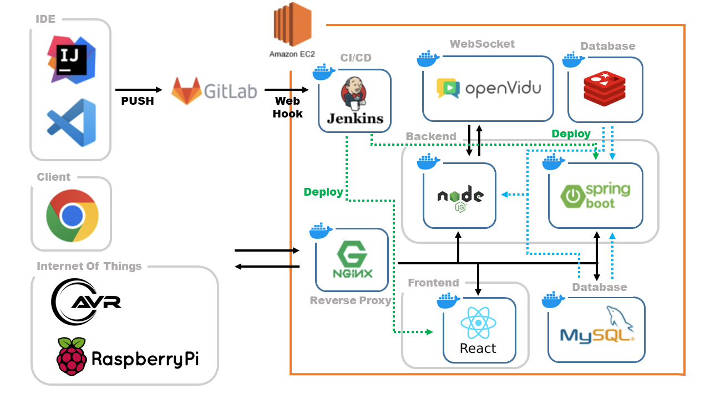

# A203삼인성호팀 - PetMeeting


## 프로젝트 개요
🟧 SSAFY 9기 공통프로젝트 - **최우수상**

2023.07.10 ~ 2023.08.18
<br><br>

## 목차
1. [프로젝트 소개](#프로젝트-소개)
2. [주요 기능](#주요-기능)
3. [Convention](#📝PR-&-Commit-Message-Rule)
4. [개발환경]()
5. [팀원 및 역할](#팀원-및-역할)
6. [프로젝트 구조](#프로젝트-구조)
7. [서비스 아키텍처](#서비스-아키텍처)

## 프로젝트 소개


## 주요 기능

<details>
<summary>기능 목록</summary>

### **1. 회원가입**


### **2. 충전**


### **3. 입양신청**


### **4. IOT기기조작**


### **5. 유기견 상세 및 후원**


### **6. 입양후기**


### **7. 문의게시판**


### **8. 마이페이지**


### **9. 이용방법**


</details>
<br><br>


# 📝PR & Commit Message Rule
<details>
<summary>📌 PR & Commit 컨벤션</summary>

### Pull Request
- 명령 / 스프린트 명 / 이름

### Commit Message
- 명령 / 스토리 또는 테스크 / 내용

### Command keyword
- :heavy_plus_sign: ADD : 파일, 디렉토리 추가
- :black_nib: MOD : 파일 수정 (파일명 수정도)
- :scissors: DEL : 파일, 디렉토리 삭제
- :open_file_folder: MOVE : 파일, 디렉토리 이동
- :boom: MERGE : 브랜치 충돌 후 직접 Merge

## Branch Rule

### Branch classification
- master: 배포 가능한 안정된 버전
- develop: 기능 개발중인 브랜치, 모든 기능 개발은 develop의 하위 브랜치에서 진행
- feature: 개발중인 기능명으로 브랜치 생성, 영문 소문자와 언더바(_)로 구성

예시
> master <br/>
> develop <br/>
> &nbsp; └ frontend <br/>
> &nbsp;&nbsp;&nbsp;&nbsp;&nbsp; └ login <br/>
> &nbsp; └ backend <br/>
> &nbsp;&nbsp;&nbsp;&nbsp;&nbsp; └ reservation <br/>

### Git branch 사용법

- 현재 branch 확인<br/>
  `git branch`
- 새로운 branch 생성하기<br/>
  `git branch 브랜치명`
- branch 이동하기<br/>
  `git switch 브랜치명`
- branch를 생성하면서 이동하기<br/>
  `git switch -c 브랜치명`
- 변경사항 복원하기<br/>
  `git restore 파일명`
- branch 삭제하기<br/>
  `git branch -d 브랜치명`
- branch push하기<br/>
  `git push -u origin 브랜치명` (원격 레포지토리에 브랜치가 없을 때)<br/>
  `git push`
</details>

---
<br>

# 📝DB
<details>
<summary>📌 DB 네이밍 컨벤션</summary>

## **1. 테이블 및 기타 관계는 단수형을 사용한다**

## **2. 테이블명 설정시 예약어, 약어는 피한다**


- 유기견 놀이 예약테이블 : ~~RV-devise~~ -> reservation-device


## **3. 테이블명은 소문자로 작성한다**
```
- 두 개 이상의 단어를 조합해서 쓸 때는 스네이크케이스로 쓴다.
- 한 단어일때는 소문자로 적는다.
```

## **4. 필드명은 스네이크 케이스 사용한다**
```
유기견 테이블 - 몸무게 : weight
```

## **5. 기본키 필드는 `접두어_no` 형식을 사용한다**
```
유기견놀이예약고유번호 : reservation_device_no
```

## **6. 외래키 필드이름은 참조한 테이블의 기본키 필드명을 사용한다**
```
입양후기게시판(post) 에서 이용자(member) 참조
-> 외래키 명 : member_no
```
## `DB 명명 규칙의 중요성`

#### ☑️ 이름은 오래간다.

데이터 구조는 일반적으로 어플리케이션 코드보다 훨씬 지속력이 높아 **영향력이 오래간다.**

#### ☑️ 이름은 계약이다.

한번 컬럼이나 테이블 이름을 정해 놓으면 개발 단계에서는 그 이름을 그대로 사용하기 때문에
**만약 컬럼과 테이블의 이름이 변경된다면 의존하고 있던 코드에서도 수정**이 일어나야 한다.

#### ☑️ 개발자 환경의 차이.

이름이 잘 정의된 테이블, 컬럼이 있다면 **개발자 본인과 다른 개발자들도 DB구조를 이해하는데 적은 시간이 소요된다.**

</details>

---
<br>

# 📝JAVA
<details>
<summary>📌 JAVA 컨벤션</summary>

[참고사이트](https://google.github.io/styleguide/javaguide.html)

### 인코딩(ENCODING)
기본 UTF-8

### 자바 소스 파일 구조
1. 시작 주석(있을 경우)  


2. Package & Import 명세  


3. 최상위 Class 및 Interface 선언  
  
### 선언 ★
- static import에만 와일드 카드(*)를 허용한다.  
  (클래스를 import할 때는 와일드 카드없이 모든 클래스명을 다 쓴다.)
    
- 클래스/메서드/멤버변수의 제한자는 아래의 순서로 쓴다.  
    (https://docs.oracle.com/javase/specs/jls/se7/html/jls-18.html 참조)
  
- 어노테이션 선언 후 새 줄을 사용한다. 단, 파라미터가 없는 어노테이션은 같은 줄에 선언할 수 있다.
- 문장이 끝나는 ; 뒤에는 새 줄을 삽입한다.
- 하나의 선언문에는 하나의 변수만 작성한다.

- 배열 선언에 오는 대괄호([])는 타입의 바로 뒤에 붙인다.

- long형의 숫자에는 마지막에 대문자'L'을 붙인다.

</details>

---
<br>

# 📝Jira
<details>
<summary>📌 Jira 컨벤션</summary>

[Jira 컨벤션 참고](https://upsw-p.tistory.com/25)

## 🚗스프린트
- 각 스프린트는 1주일을 기준으로 진행한다.
- 각 스프린트 기준으로 일인당 40 Point의 스토리 포인트가 부여된다.
  - 하루에 8포인트 ( 8시간 ) * 5 = 40 Point
## 🚓이슈 등록
- 이슈 등록은 개인이 JIRA Convention에 맞추어 등록한다.
- 이슈 등록 후 해당 이슈에 본인 파트의 팀원을 등록한다.
## 🚕이슈관리
- 최초 이슈를 할당받으면 담당자는 스토리 포인트를 부여한다.
- 또한 해당 이슈의 우선순위를 설정한다.
- 작업 들어가기 전 할 일 --> 진행 중
- 진행 완료하면 --> 완료로 상태를 최신화한다.
- 설명란에 최대한 자세히 해당 이슈에 있어서 `담당자`가 작성한다.
- 모든 이슈 관련 문의는 댓글 기능을 통해 이뤄지며 SNS/전화는 지양한다.


## 🚌작업유형
### - Epic(에픽)
- 큰 단위의 업무(기능 명세서 기준, 중분류 단위)로 에픽을 생성한다.
- 매주 월요일 스프린트를 들어가기 전에 Epic들을 검토하고 수정사항과 수행해야하는 하위 Task 들을 정한다.
- 논의한 Epic을 기본으로 해당 Epic에 담당자를 지정하여 생성한다.

### - Task(작업)

- Epic 하위에 기능명세서의 소분류 기준으로 task를 생성한다.
- task의 Description에 스토리를 적는다.
- 스프린트에 넣을 때, `서브테스크 단위를 사용하지 않기 위해서` 생성컨벤션에 맞춰서 해당이슈를 재생성하여 추가한다.

```js
[생성컨벤션]

ex) [BE]1-1-1 일반회원가입 , [FE]1-1-1 일반회원가입, [IOT]1-1-3 기기조작

[BE] : Back-end

[FE] : Front-end

[IOT] : Internet of Things
```


### - 스토리
- 기능 구현에 해당하지 않는 기타 내용들을 스토리로 작성한다.


</details>


## 팀원 및 역할


## 프로젝트 구조


## 서비스 아키텍처
